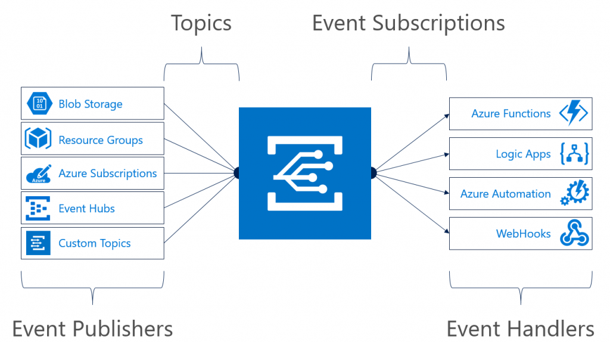
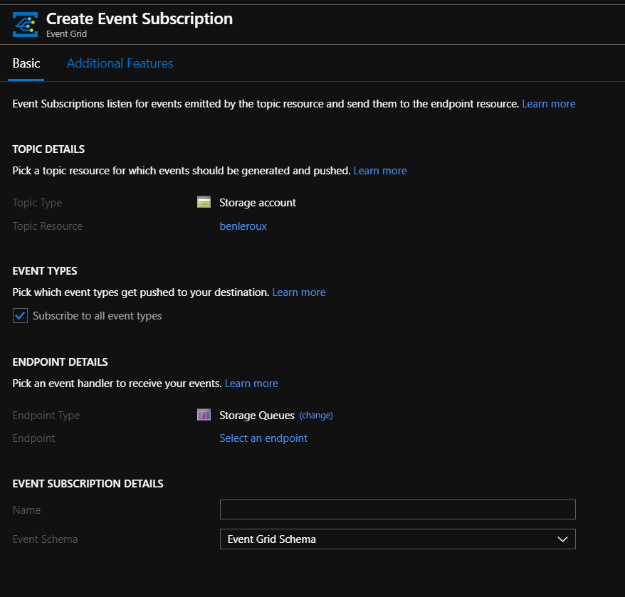
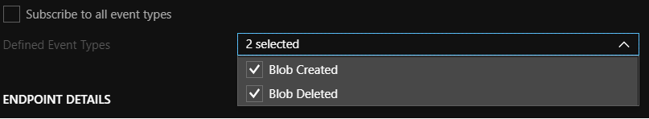
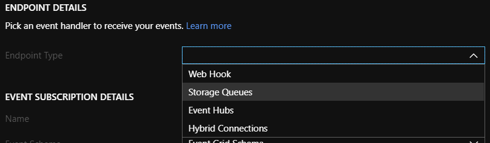
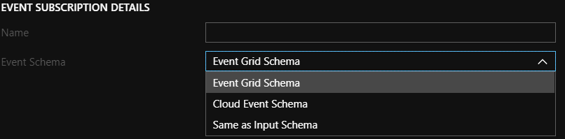
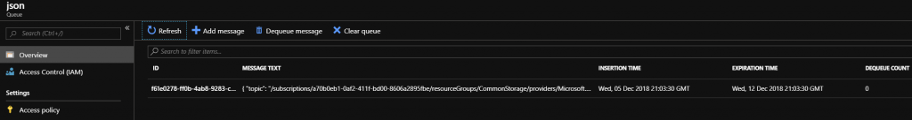

Have you ever wanted to process in near real time new files added to your Azure Storage account (BLOB)? Have you tried using Azure EventHub but files are too large to make this a practical solution? 

Let me present you to ABS-AQS file source...



Azure Storage Topics using Event Grid 

## Optimized Azure Blob Storage File Source with Azure Queue Storage

Databricks have added the support of near real time processing of Changes via the Storage Account **event** processing via Storage queues.

Detailed in their [**documentation**](https://docs.azuredatabricks.net/spark/latest/structured-streaming/aqs.html), you can setup a Databricks readstream to monitor the Azure Storage queue which tracks all the changes.

In order to make this work, you will need a few things as detailed [**here**](https://docs.microsoft.com/en-us/azure/storage/blobs/storage-blob-event-overview): 

1. An Azure Storage Account (BLOB)
2. Create a storage queue
3. Setting up events using Storage Queue as the end point.
4. Generate a [**connection string**](https://docs.microsoft.com/en-us/azure/storage/common/storage-account-manage) for Databricks to use and note a storage account key.

Doing step #2 will ask you to create an EventGrid Subscription. This part was confusion to me, so here's how it should be done.



I recommend unchecking the "Subscribe to all event types". This will at best highlight all the events you want to process. For example, you don't care for files that are deleted.

- 
    

<Callout>
You can also filter the deleted events in Databricks but doing it here to simplify the processing
</Callout>

You will need to select Storage Queues for the Endpoint Type



Doing the above will add a new configuration for Endpoint which you will need to set to the storage queue created above.

Finally, select Event Grid Schema, which is detailed [here](https://docs.microsoft.com/en-us/azure/event-grid/event-schema),  for the Event Schema.



### Testing your setup

If you did everything correctly, you should see records created when you drop files in your BLOB storage account



## Processing Events in  Databricks

Now that the nuts and bolts are done, you can now process the events in Databricks.

### Setting up WASB access to blob

spark.conf.set( "fs.azure.account.key.**[STORAGE ACCOUNT NAME]**.blob.core.windows.net", **[STORAGE ACCOUNT KEY]**)

<Callout>
**Note**, even through you might have mounted the BLOB account, the above steps is still required.
</Callout>

### Specifying the layout of the files to process

<Callout>
Think about specifying a [filter](https://docs.microsoft.com/en-us/azure/event-grid/subscription-creation-schema#filter-object) to limit the file types you want to capture events for.
</Callout>

In this example, I will process JSON deposited in the BLOB Storage Account. Doing so will require me to specify a schema. This can be defined using StructType.

For example, the following JSON:

```` json
{
  "Amounts": {
    "amount": "14131441179.6617",
    "currencyCode": "EU"
  }
}
````

Will be represented as the following schema:

````Scala
val schema =   
StructType( List (  
      StructField("Amounts",  
         StructType(List(  
            StructField("amount",StringType,true),   
            StructField("currencyCode",StringType,true)  
        ))  
     ))  
)
````

### Setup the Structured Streaming 

When setting up the input stream, you will need to specify a few things:

<table><tbody><tr><td><strong>format</strong>:</td><td>This should be set to abs-aqs</td></tr><tr><td><strong>fileFormat</strong>:</td><td>The format of the files such as parquet, json, csv, text, and so on.</td></tr><tr><td><strong>queueName</strong>:</td><td>The name of the Storage Account Queue created earlier</td></tr><tr><td><strong>multiLine</strong>:</td><td>This allows your JSON to formated on multiple lines</td></tr><tr><td><strong>ignoreDeletes</strong>:</td><td>Optional, this ignore deleted events</td></tr><tr><td><strong>schema</strong>:</td><td>The structured schema defined for the JSON</td></tr></tbody></table>

See this [**link**](https://docs.azuredatabricks.net/spark/latest/structured-streaming/aqs.html#id3) for complete details on all the options available.

You can now execute the following Scala code to prep the stream:

````Scala
val inputStream = spark  
  .readStream.format("abs-aqs")  
  .option("fileFormat", "json")  
  .option("queueName", "**[QUEUE NAME CREATED]**")  
  .option("multiLine", true)   
  .option("ignoreDeletes", "true")  
  .option("connectionString", **[STORAGE ACCOUNT CONNECTION STRING]**)  
  .schema(schema)  
  .load()
````

<Callout>
Remember, spark is lazy! It will not do anything until you execute an action; like display for example.
</Callout>

### Starting the stream

You are now ready to capture the streaming events coming from your Azure Storage. The following will simply output to the screen but you could much more, like saving to a Delta table.

Display(inputStream)

  

<Callout>
If you get a printout with all NULLS, check your schema definition. This tends to happen when it can't understand the file structure.
</Callout>

Thanks!
