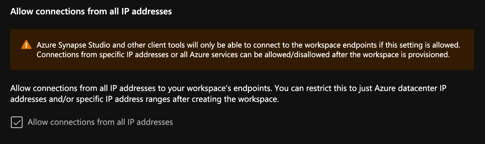
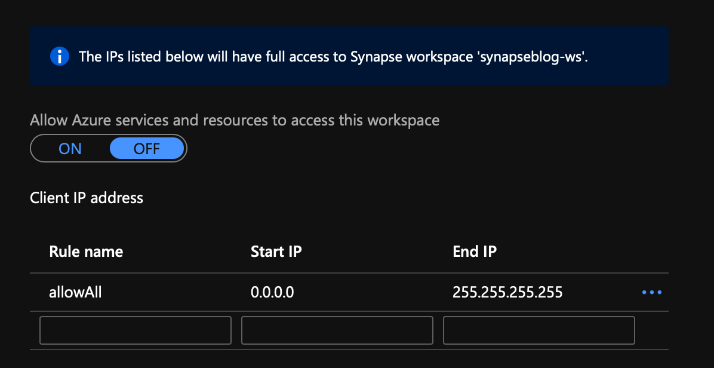
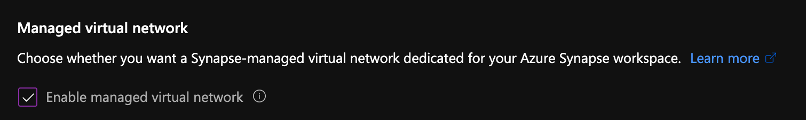
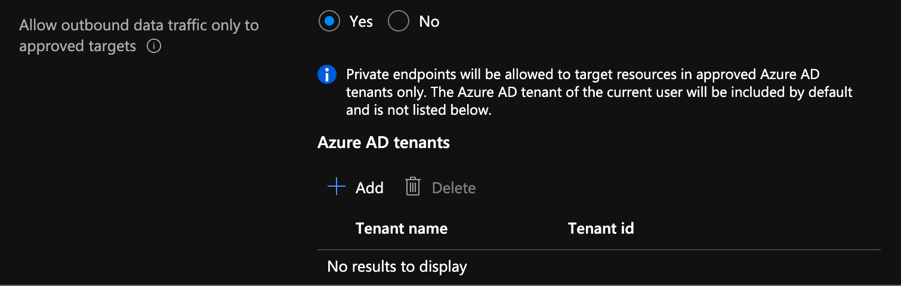
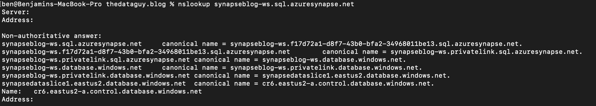
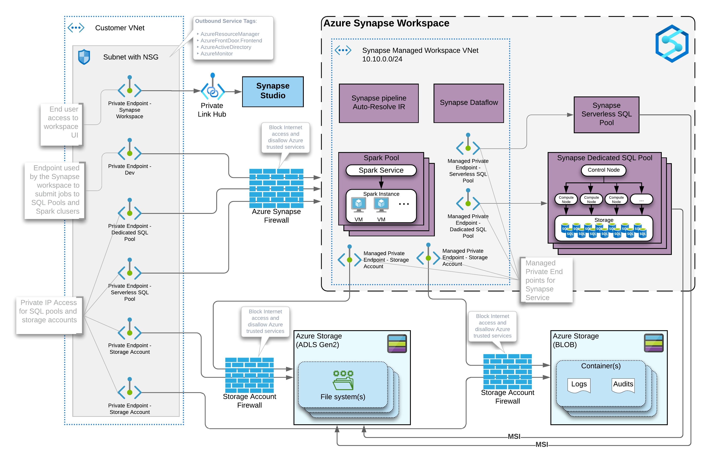

import { Callout } from "../../src/components/atoms.js"
import { ExtLink, InlinePageLink } from "../../src/components/atoms.js"

In the past year or so, I've been knee-deep in [Azure Synapse](https://docs.microsoft.com/en-us/azure/synapse-analytics/). I have to say, 
it's been a super popular platform in Azure. Many clients are either migrating 
to Azure Synapse from SQL Server, data warehouse appliances or implementing 
net new solutions on Synapse Analytics.

One of the most asked questions or subjects that are top of mind revolves around security. As company move sensitive data to the cloud, checks and balances 
need to be in place to meet security requirements and the first thing that comes 
up is: does my data flow through the internet? 

In comes private endpoints, virtual networks, private and public IPs. 🤦‍♂️ Things 
start getting complex...

So lets try to make sense of all this.

<Callout>
  💡 Note, I will not be doing a deep dive into networking as there are people 
  that are more knowledgeable on this subject. But, will try to clarify to the best
  of my abilities 🖖🏻
</Callout>

## Network security

In order to expand on the topic of security and network traffic, we need to dive into
network security.

This topic can be broken down in a few categories:

- [Firewall](#firewall)
- [Virtual network](#virtual-network)
- [Data exfiltration](#data-exflitration)
- [Private endpoint](#private-endpoints)

## Firewall

Google defines firewall as _"... a security device that monitors 
and filters incoming and outgoing network traffic based on an organization's 
previously established security policies. ... A firewall's main purpose is to 
allow non-threatening traffic in and to keep dangerous traffic out."_

In the context of Azure Synapse, it will allow you to grant or deny access to 
your Synapse workspace based on IP addressed. This can be effectively used to 
bloc internet traffic to your workspace.

When creating your workspace, you have the option to allow **ALL** IP address through.

If you enable this option, you'll end up with the following rule added:

<Callout>
  💡 Note, if you don't enable this, you will <b>NOT</b> be able to connect to your 
  workspace right away. Best to keep it enabled, then go back and modify / tweek  it.
</Callout>

See this documentation from Microsoft on [Synapse workspace IP Firewall rules](https://docs.microsoft.com/en-us/azure/synapse-analytics/security/synapse-workspace-ip-firewall)

## Virtual Network

Virtual network will give you network isolation with other workspaces. This is 
accomplished by enabling the **"Enable managed virtual network"** option during 
the deployment of the workspace.

<Callout>
  🚨 <b>Alert</b>, you can only enable this option during the creation of your
  workspace.
</Callout>

The great thing about this is it gives you all the benefits of having your workspace
in a virtual network without the need to manage it. Look it up [here](https://docs.microsoft.com/en-us/azure/synapse-analytics/security/synapse-workspace-managed-vnet)
for more details on benefits.

## Data Exflitration

Another benefit of enabling managed virtual network and private endpoints, which
we're tackling next, is that you're now protected against data exfiltration.

<Callout>
  ≝ Definition: Data Exfiltration guards against malicious insiders accessing 
  your Azure resources and exfiltrating sensitive data to locations outside of 
  your organization’s scope. 
</Callout>

In addition to enabling the managed virtual network option, you can also specify
which Azure AD tenant can connect to your workspace endpoints .

Check out this documentation on [data exfiltration with Synapse](https://docs.microsoft.com/en-us/azure/synapse-analytics/security/workspace-data-exfiltration-protection)

## Private Endpoints

Microsoft defines [Private Endpoints](https://docs.microsoft.com/en-us/azure/private-link/private-endpoint-overview) as _"Azure Private Endpoint is a network 
interface that connects you privately and securely to a service powered by Azure Private Link. Private Endpoint uses a private IP address from your VNet, 
effectively bringing the service into your VNet."_

In short, you can use a private IP to connect to a public service... Well, kind of. 

Every workspace comes with a few endpoints: 

|                         |                                                                                                         |
| ----------------------- | ------------------------------------------------------------------------------------------------------- |
| Dedicated SQL endpoint  | Used to connect to the _**Dedicated**_ SQL Pool from external applications like Power BI, SSMS          |
| Serverless SQL endpoint | Used to connect to the _**Serverless**_ SQL Pool from external applications like Power BI, SSMS         |
| Development endpoint    | This is used by the workspace web UI as well as DevOps to publish artifacts like SQL scripts, notebook. |
| workspace web URL       | Used to connect to the Synapse Studio web UI                                                            |

If we take the dedicated SQL endpoint for example, we add private endpoint, what's 
basically happening is when you connect to it, your requests goes 
through a **DNS** (**D**omain **N**ame **S**ervice translates domain names to IP addresses 
so browsers can load Internet resources) redirection to a private DNS.

If you do a tracerout to the SQL endpoint, you can see it routes to the private endpoint:

### Managed Private Endpoints

When you create a new Synapse workspace, you'll notice in the Synapse Studio, under the manage hub, security section and 
managed private endpoint that 2 private endpoints were created by default.

<Callout>
  💡 Note, for the curious that noticed the private endpoint blade in Azure portal for the Synapse resource 
  and wondering what that's about, I'll cover that next.
</Callout>

When you deploy a Synapse workspace in a managed virtual network, you need to tell Synapse how to communicate with other
Azure PaaS (**P**latform **A**s **A** **S**ervice)

Therefore, these endpoints are required by the Synapse workspace to communicate with the 2 SQL pools; dedicated and serverless... This 
will make more sense once you see the detailed architecture diagram.

🚨 Alert, one common issue I see people facing is their Spark pools not being able to read files on the storage account.
This is because you need to manually create a managed service endpoint the storage account.  Check out this documentation to
see how: [How to create a managed private endpoint](https://docs.microsoft.com/en-us/azure/synapse-analytics/security/how-to-create-managed-private-endpoints)

### Private Endpoint Connections

Now that we've covered managed private endpoints, you're probably asking yourself why you have a private endpoint
connections blade in the Azure portal for your Synapse workspace.

Where managed private endpoints allows the workspace to connect to other PaaS services outside of its managed virtual
network, private endpoint connections allow for everyone and everything to connect to Synapse endpoints using a private
endpoint.

You will need to create a private endpoint for the following:

|                         |                                                         |
| ----------------------- | ------------------------------------------------------- |
| Dedicated SQL endpoint  | Select the SQL sub resource during the creation.         |
| Serverless SQL endpoint | Select the SqlOnDemand sub resource during the creation |
| Development endpoint    | Select the DEV sub resource during the creation.         |

### Private Link Hub

## Time to put it all together!

