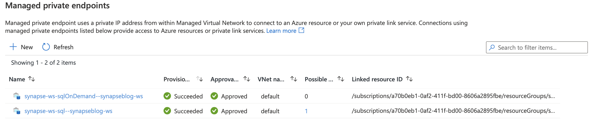
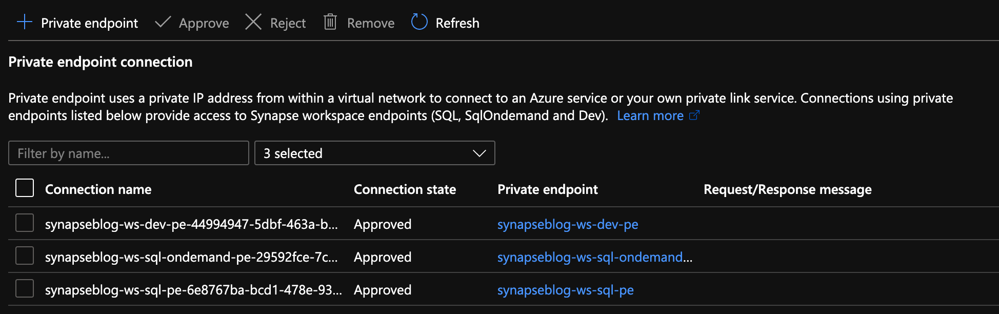

 
import { Callout } from "../../src/components/atoms.js"
import { ExtLink, InlinePageLink } from "../../src/components/atoms.js"

In the past year or so, I've been knee-deep in [Azure Synapse](https://docs.microsoft.com/en-us/azure/synapse-analytics/). I have to say, 
it's been a super popular platform in Azure. Many clients are either migrating 
to Azure Synapse from SQL Server, data warehouse appliances or implementing 
net new solutions on Synapse Analytics.

One of the most asked questions or subjects that are top of mind revolves around security. As company moves sensitive data to the cloud, checks and balances 
need to be in place to meet security requirements and the first thing that comes 
up is: does my data flow through the internet? 

When it comes down to private endpoints, virtual networks, private and public IPs. 🤦‍♂️ Things 
start getting complex...

So let’s try to make sense of all this.

<Callout>
  💡 Note, I will not be doing a deep dive into networking as there are people 
  that are more knowledgeable on this subject. But, I will try to clarify to the best
  of my abilities 🖖🏻 (live long and prosper).
</Callout>

## Network security

In order to expand on the topic of security and network traffic, we need to dive into
network security.

This topic can be broken down in a few categories:

- [Firewall](#firewall)
- [Virtual network](#virtual-network)
- [Data exfiltration](#data-exflitration)
- [Private endpoint](#private-endpoints)

## Firewall

Bing defines firewall as _"... a security device that monitors 
and filters incoming and outgoing network traffic based on an organization's 
previously established security policies. ... A firewall's main purpose is to 
allow non-threatening traffic in and to keep dangerous traffic out."_

In the context of Azure Synapse, it will allow you to grant or deny access to 
your Synapse workspace based on IP addresses. This can be effectively used to 
block traffic to your workspace via the internet. Normally, firewalls would control both
outbound and inbound traffic, but in this case, it's inbound only.

I'll cover outbound later when talking about managed virtual network and data exfiltration.

When creating your workspace, you have the option to allow **ALL** IP address through.


If you enable this option, you'll end up with the following rule added:


<Callout>
  💡 Note, if you don't enable this, you will <b>NOT</b> be able to connect to your 
  workspace right away. Best to keep it enabled, then go back and modify / tweak  it.
</Callout>

See this documentation from Microsoft on [Synapse workspace IP Firewall rules](https://docs.microsoft.com/en-us/azure/synapse-analytics/security/synapse-workspace-ip-firewall)

## Virtual Network

Virtual network will give you network isolation against other workspaces. This is 
accomplished by enabling the **"Enable managed virtual network"** option during 
the deployment of the workspace.


<Callout>
  🚨 <b>Alert</b>, you can only enable this option during the creation of your
  workspace.
</Callout>

The great thing about this is it gives you all the benefits of having your workspace
in a virtual network without the need to manage it. Look it up [here](https://docs.microsoft.com/en-us/azure/synapse-analytics/security/synapse-workspace-managed-vnet)
for more details on benefits.

## Data Exfiltration

Another benefit of enabling managed virtual network and private endpoints, which
we're tackling next, is that you're now protected against data exfiltration.

<Callout>
  ≝ Definition: occurs when malware and / or a malicious actor carry out an unauthorized data transfer from a computer. 
  It is also commonly called data extrusion or data exportation.   
</Callout>

In the context of Azure, protection against data exfiltration guards against malicious insiders accessing 
your Azure resources and exfiltrating sensitive data to locations outside of your organization’s scope.

In addition to enabling the managed virtual network option, you can also specify
which Azure Active Directory tenant your workspace can communicate with.


Check out this documentation on [data exfiltration with Synapse](https://docs.microsoft.com/en-us/azure/synapse-analytics/security/workspace-data-exfiltration-protection)

## Private Endpoints

Microsoft defines [Private Endpoints](https://docs.microsoft.com/en-us/azure/private-link/private-endpoint-overview) as _"Azure Private Endpoint is a network 
interface that connects you privately and securely to a service powered by Azure Private Link. Private Endpoint uses a private IP address from your VNet, 
effectively bringing the service into your VNet."_

In short, you can access a public service using a private endpoint.

Every Synapse workspace comes with a few endpoints which are used to connect to and from various applications: 


|                         |                                                                                                         |
| ----------------------- | ------------------------------------------------------------------------------------------------------- |
| Dedicated SQL endpoint  | Used to connect to the _**Dedicated**_ SQL Pool from external applications like Power BI, SSMS          |
| Serverless SQL endpoint | Used to connect to the _**Serverless**_ SQL Pool from external applications like Power BI, SSMS         |
| Development endpoint    | This is used by the workspace web UI as well as DevOps to execute and publish artifacts like SQL scripts, notebook. |
| workspace web URL       | Used to connect to the Synapse Studio web UI                                                            |

If we take the dedicated SQL endpoint for example and we add private endpoint. What's 
basically happening is when you connect to it, your request goes 
through a redirection to a private IP.

If you do a nslookup to the SQL endpoint, you can see it routes to the private endpoint:

```bash
nslookup synapseblog-ws.sql.azuresynapse.net
```


### Managed Private Endpoints

Synapse uses a managed VNET / Subnet (i.e. not a customer’s) and exposes private endpoints in customers’ vnets as needed. This is the reason you never pick a VNET in the wizard during the creation. 

Since that VNET belongs to Microsoft and is managed, it is isolated by itself.  It therefore requires private endpoints from other PaaS to be created into it.

<Callout>
  It is similar to how the managed VNET feature of Azure Data Factory operates.
</Callout>

I have a diagram outlining all this later.

When you create a new Synapse workspace, you'll notice in the Synapse Studio, under the manage hub, security section and 
managed private endpoint that 2 private endpoints were created by default.



<Callout>
  💡 Note, for the curious that noticed the private endpoint blade in Azure portal for the Synapse resource and wondering what that's about, I'll cover that next.
</Callout>

When you deploy a Synapse workspace in a managed virtual network, you need to tell Synapse how to communicate with other
Azure PaaS (**P**latform **A**s **A** **S**ervice)

Therefore, these endpoints are required by Synapse's orchestration (the studio UI, Synapse Pipeline, etc.) to communicate with the 2 SQL pools; dedicated and serverless... This 
will make more sense once you see the detailed architecture diagram.

<Callout>

🚨 Alert, one common issue I see people facing is their Spark pools not being able to read files on the storage account.
This is because you need to manually create a managed service endpoint the storage account.  

Check out this documentation to
see how: [How to create a managed private endpoint](https://docs.microsoft.com/en-us/azure/synapse-analytics/security/how-to-create-managed-private-endpoints)

</Callout>

### Private Endpoint Connections

Now that we've covered managed private endpoints, you're probably asking yourself why you have a private endpoint
connection blade in the Azure portal for your Synapse workspace.


Where managed private endpoints allows the workspace to connect to other PaaS services outside of its managed virtual
network, private endpoint connections allow for everyone and everything to connect to Synapse endpoints using a private
endpoint.

You will need to create a private endpoint for the following:

|                         |                                                         |
| ----------------------- | ------------------------------------------------------- |
| Dedicated SQL endpoint  | Select the SQL sub resource during the creation.        |
| Serverless SQL endpoint | Select the SqlOnDemand sub resource during the creation |
| Development endpoint    | Select the DEV sub resource during the creation.        |

### Private Link Hub

You might've noticed in the list of private endpoint, we only had 3 of them while your workspace has 4 endpoints.
That's because the studio workspace web URL will need a Private Link Hub to setup the secured connection.

Check out this document for instructions on how to set this up.

[Connect to Azure Synapse Studio using Azure Private](https://docs.microsoft.com/en-us/azure/synapse-analytics/security/synapse-private-link-hubs)

## Time to put it all together!

Now that we've covered [firewalls](#firewall), [managed private endpoint](#managed-private-endpoints), 
[private endpoint connections](#private-endpoint-connections) and [private link hub](#private-link-hub), let’s take
a look how it looks when you deploy a secured end to end Synapse workspace.


This architecture assumes the following:

1. You have two storage accounts, one for the workspace file system (this is required by Synapse deployment), the another, to store any audits and logs.

2. For each of the storage accounts, you've disabled access from all networks and enabled the firewall to block 
internet traffic.

Now let's break this diagram down.

### Synapse workspace


1. The virtual network created as part of the managed vNet workspace deployment. This 
vNet is managed by Microsoft and cannot be seen in the Azure portal's resource list. 

2. It contains the compute for the self-hosted integration runtime and the compute for 
the Synapse Dataflow.

3. Any spark pools will create virtual machines behind the scenes. These will also
be hosted inside the managed virtual network (vNet).

4. The Serverless SQL pool is a multi-tenant service and will not be physically deployed in the 
vNet but you can communicate with the service via private endpoints. 

5. Same as the Serverless SQL pools, it's a multi-tenant service and will not be physically deployed in the 
vNet but will communicate with the service via private endpoints. 
<Callout>
  💡 Remember the two managed private endpoints created when you deployed your new Synapse
workspace? This is why they're created.
</Callout>

### Synapse Studio


1. The workspace studio UI is a single-page application (SPA) and is created as part of the
Synapse workspace deployment.

2. Utilizing an [Azure Synapse Link Hub](#private-link-hub), you're able to create a private endpoint into the customer's owned vNet.

3. Users can connect to the Studio UI using this private endpoint.

4. Executions like notebooks or SQL scripts made from the studio web interface will submit commands via the DEV private endpoint 
and ran on the appropriate pool.

<Callout>
  💡 Note, the web app for the UI will not be visible and is managed by Microsoft
</Callout>

### Storage Accounts and Synapse


1. For each workspace created, you will need to specify a storage account / file system with hierarchical name space 
enabled in order for Synapse to store its metadata. 

2. When your storage account is configured to limit access to certain vNets, endpoints
are needed to allow the connection and authentication. Similar to how Synapse needs private endpoints to communicate with the 
storage account, any external systems or people that need to read or write
to the storage account will require a [private endpoint](#private-endpoint-connections).

3. Every storage accounts that you connect to your Synapse workspace via linked services will
need a [managed private endpoint](#managed-private-endpoints) like we mentioned previously. This applies 
to each service within the managed vNet.  

4. Optional: You can use another storage account to store any logs or audits.
<Callout>
  💡 Note, logs and audits cannot use storage accounts with hierarchical namespace
  enabled. Hence the reason why we have 2 storage accounts in the diagram.
</Callout>

5. The SQL pools, which are multi-tenant services, talk to the Storage over public IPs but use trusted 
service based isolation. However, going over public IPs doesn't mean data is going to the internet. 
Azure networking implements cold potato routing, so traffic stays on Azure backbone as long as the two 
entities communicating are on Azure. 
This can be configured within the storage account networking configuration.

Or can also be set during the Synapse workspace creation.

<Callout>
  ≝ Definition: In commercial network routing between autonomous systems which are interconnected in 
  multiple locations, hot-potato routing is the practice of passing traffic off to another autonomous 
  system as quickly as possible, thus using their network for wide-area transit. Cold-potato routing is 
  the opposite, where the originating autonomous system holds onto the packet until it is as near to the 
  destination as possible.
</Callout>


### Private endpoints in customer-owned vNet

Like I mentioned previously for the storage accounts, private endpoints need to be
created in the customer's vNet for the following:

1. Dedicated SQL Pool
2. Serverless SQL Pool
3. Dev

Like you can see here:



## Conclusion

Hope this helps clarifying some of the complexities of deploying a secured Synapse workspace and that you understand
the nuances of each private endpoint.

The last piece of the puzzle that can cause issues would be authentication and access control. 

I can't recommend strongly enough that you go through this documentation which outlines all the steps you need to take.

[How to set up access control for your Synapse workspace](https://docs.microsoft.com/en-us/azure/synapse-analytics/security/how-to-set-up-access-control)

Thanks!

