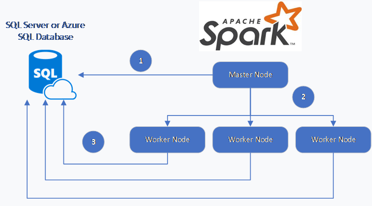
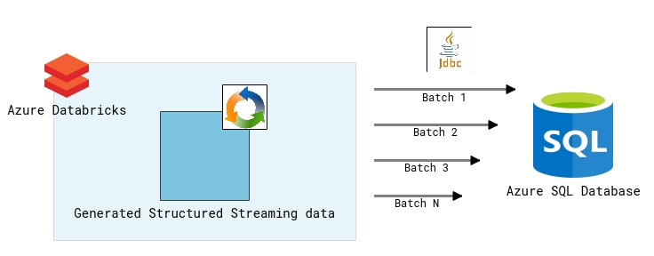

As you may have noticed, my go to language is Scala when it comes to Azure Databricks and Spark. With that said, Scala has a great library to read and write data to Azure SQL Database. Along with some great options, the one that stands out the most is the ability to bulk load.

See [here](https://docs.microsoft.com/en-us/azure/sql-database/sql-database-spark-connector) for details on this library.

I've been asked a few times about doing the same in Python; easier said than done. You basically have 2 options (that I've found): JDBC or PyODBC. PyODBC is great and it also allows you to execute stored procedures but it's a Python library and not PySpark. The difference? One is distributed and made to take advantage of Databricks clusters. As for JDBC, that works fairly well but struggled on how to push batches at a time in a Structured Streaming setting.

### Structured Streaming? Why?

Structured streaming is a nice feature in Azure Databricks that allows you to perform the computation incrementally and continuously updates the result as streaming data arrives. This method as becomes more popular than the traditional Spark streaming.

Here's a good example for both Scala and Python: [https://docs.microsoft.com/en-us/azure/databricks/\_static/notebooks/structured-streaming-python.html](https://docs.microsoft.com/en-us/azure/databricks/_static/notebooks/structured-streaming-python.html)

### So, What's this blog post about?

Glad you asked :) I will be showing how to take a structured streaming and batch push to Azure SQL Database.

### Prerequisites

<table>
   <tbody>
      <tr>
         <td>Azure SQL Database:</td>
         <td>You can create a small singleton DB</td>
      </tr>
      <tr>
         <td>Server / Database properties:</td>
         <td>- Server Name  - Database Name  - SQL User Name  - SQL User Password</td>
      </tr>
      <tr>
         <td>An Azure Databricks workspace with cluster:</td>
         <td>Cluster can have 1 worker for this example</td>
      </tr>
   </tbody>
</table>

### My Notebook

Below is the notebook I used in Databricks.

[My notebook](https://thedataguy.blog/wp-content/uploads/2020/04/Stream-Bulk-to-SQLDB.html)

<iframe src="https://thedataguy.blog/wp-content/uploads/2020/04/Stream-Bulk-to-SQLDB.html" width="100%" height="2960" frameborder="0"></iframe>

### Conclusion

As this notebook run, you will notice your SQL DB table increase in batches of 100k records.

You can play with the partition count to increase parallelism and / or the rows per second to increase the batch. Monitor as you increase as you may saturate the JVM processes for Spark or the Azure SQL Database throughput.

Hope this helps!
