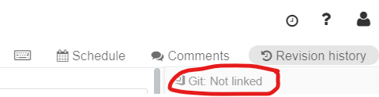

import { Callout } from "../../src/components/atoms.js"
import { ExtLink, InlinePageLink } from "../../src/components/atoms.js"

So you've created notebooks in your Databricks workspace, collaborated with your peers and now you're ready to operationalize your work. This is a simple process if you only need to copy to another folder within the same workspace. But what if you needed to separate your DEV and PROD?

Things get a little more complicated when it comes to automating code deployment; hence CI/CD.

## What is CI/CD?

_A CI/CD pipeline._

Continuous integration (CI) and continuous delivery (CD) embody a culture, set of operating principles, and collection of practices that enable application development teams to deliver code changes more frequently and reliably. The implementation is also known as the CI/CD pipeline and is one of the best practices for devops teams to implement.

## Implementing CI/CD in Azure Databricks

Example of continuous integration and delivery

The flow is simple:

1. A developer develops
2. Then he checks in his code into source control
3. The developer branch is then pushed to the master branch
4. The code is then pushed to various environment; DEV; TEST; PROD

For the purpose of this blog, I will demonstrate how a notebook committed to Azure DevOps can be automatically pushed to another branch (folder) of the same workspace.

<Callout>
💡 Note, the target workspace can be another Databricks environment. But to simplify the explanation, I used the same one
</Callout>

## Prerequisites

Make you you have the following :

<table><tbody><tr><td><strong>A Databricks workspace</strong></td><td>You can follow <a rel="noreferrer noopener" aria-label="these  (opens in a new tab)" href="https://docs.microsoft.com/en-us/azure/azure-databricks/quickstart-create-databricks-workspace-portal" target="_blank"><strong>these </strong></a>instructions if you need to create one.</td></tr><tr><td><strong>An Azure DevOps project / Repo</strong></td><td>See <a rel="noreferrer noopener" aria-label="here  (opens in a new tab)" href="https://docs.microsoft.com/en-us/azure/devops/organizations/projects/create-project?view=vsts&amp;tabs=new-nav" target="_blank"><strong>here </strong></a>on how to create a new Azure DevOps project and repository.</td></tr><tr><td><strong>A Sample notebook we can use for our CI/CD example</strong></td><td><a rel="noreferrer noopener" aria-label="This  (opens in a new tab)" href="https://docs.microsoft.com/en-us/azure/azure-databricks/databricks-extract-load-sql-data-warehouse" target="_blank"><strong>This </strong></a>tutorial will guide you through creating a sample notebook if you need.</td></tr></tbody></table>

## Binding your DevOps Project

Next, you will need to configure your Azure Databricks workspace to use Azure DevOps which is explained [**here**](https://docs.azuredatabricks.net/user-guide/notebooks/azure-devops-services-version-control.html).

## Syncing your notebooks a Git Repo

When you open your notebook, you will need to click on **Revision history** on the top right of the screen. By default, the notebook will not be linked to a git repo and this is normal.

Notebook not linked to a repo

If you click on "Not linked", you will be asked a few things:

<table><tbody><tr><td><strong>Status</strong></td><td>You will need to set this to "Link"</td></tr><tr><td><strong>Link</strong></td><td>Change the values encapsulated by &lt;&gt; with the appropriate information.</td></tr><tr><td><strong>Branch</strong></td><td>Leave this to master for now. But should follow your companies DevOps best practices</td></tr><tr><td><strong>Path in Git Repo</strong></td><td>Folder in Git where the notebook will be created</td></tr></tbody></table>

<Callout>
💡 Note, if you use the classic URL for Azure DevOps, the organization name is part of the URL as per this example: https://[myOrg].visualstudio.com. If you use the new format, you will find it as per: https://dev.azure.com/[myOrg].
</Callout>

If done properly, you will see the "Git: Synced" status

Notebook linked to a Git repo

Once synced, you will need to save your changes to Git.

## Building your CI / CD Pipeline in Azure DevOps

Now that you committed your notebook to Azure DevOps, it's time to build your CI/CD pipeline.

What is an **Azure Pipelines**? It's a fully featured continuous integration (CI) and continuous delivery (CD) service. It allows you to build, test and deploy your code to any platform. Add more parallel jobs for even faster **pipelines**. Build and deploy on Microsoft-hosted Linux, macOS and Windows.

Well be concentrating on build and release; leaving test for another blog :)

## Creating a new build pipeline

A continuous integration trigger on a **build pipeline** indicates that the system should automatically queue a new **build** whenever a code change is committed.  This is the **CI** portion of our process.

Selecting your project, you will be brought into the project summary where you will see various option on the tool bar on the right. The one that is important for us now is the Pipelines one. Clicking on **"Pipelines"** will reveal a sub menu and start off with build.  
You will then need to click on **"New"** and then **"new build pipeline"**.

Creating a new build pipeline

Doing so will bring you to the creation screen

Create new build pipeline

<table><tbody><tr><td><strong>Source</strong></td><td>Unless you want to / need to link to another source, keep the default to <strong>"Azure Repos Git"</strong> </td></tr><tr><td><strong>Team Project</strong></td><td>Pick the project you created</td></tr><tr><td><strong>Repository</strong></td><td>Pick the repository you created</td></tr><tr><td><strong>Default branch</strong></td><td>Keep <strong>"Master" </strong>as the default branch</td></tr></tbody></table>

Pressing **"Continue"** will bring you to the template selection screen. The pipeline we're building involves pulling the changes from the master branch and building a drop artifact which will then be used to push to Azure Databricks in the CD part. Knowing this, pick **"Empty job"**.

Name your build pipeline ADBDemo-CI and pick Hosted VS2017 pool.

<Callout>

  You can pick other types of pool. For example Linux which tends to be faster or even your own private pool if you had one. See [**here**](https://docs.microsoft.com/en-us/azure/devops/pipelines/agents/pools-queues?view=vsts) for more information regarding pools.
  
</Callout>

Next, you will click on the **"+"** sign next to **"Agent job 1"** which will bring up the list of tasks available to you. Search and add **"Publish Build Artifacts"**.

Once added, click on the added task and your screen should now look like this:

Adding a new task.

A few things of importance to note on this screen; the **Path to publish** and the **Artifact name**.

The task selected will pull artifacts from your Git repository and create a package which will be used by our release pipeline. The **Path to publish** indicates which folder in your git repository you would like to include in your build. Clicking on the ellipsis will let you browse your repository and pick a folder.

<Callout>
As you browse you will be able to select an individual file. Even if doing so will let you build successfully, the release task we'll use to push back to Databricks only supports folders. Hence the need to pick a folder and not a file.
</Callout>

The **Artifact name** identifies the name of the package you will use in the release pipeline. You can keep it as **"drop"** for simplicity.

### Queuing your build

Once you've defined your build pipeline, it's time to queue it so that it can be built. This is done by selecting the **"Save & queue"** or the **"Queue**" options. Doing so will ask you save and commit your changes to the build pipeline.

<Callout>
💡 Note, the text you enter when committing you changes will be used to identify the builds
</Callout>

View build progress

After submitting your build to the queue, you can monitor the progress by clicking the # item on the top left as per the following

Once completed you should see green check marks on all the steps

Completed build.

### Viewing the content of the build

You can inspect the content of your build by clicking the **"Artifact"** blue button on the top right. Doing so will allow you the browse the content like so:

Artifact explorer

## Building the release pipeline

Now that we have a build created, lets setup the delivery portion of the CI/CD. In order to do this, you will go back to the **"Pipelines"** menu and select **"Release"** and then **"new release pipeline"**.

Creating a new release pipeline.

Like before, you will select an empty template.

Once that is done, you will need to configure 2 sections; **artifacts** and **stages**. In the Microsoft documentation, an **artifact** is described as a deployable component of your application. It is typically produced through a Continuous Integration or a build pipeline and a **stage** is described as a _logical_ and _independent_ entity that represents where you want to deploy a release generated from a release pipeline.

Example of a release pipeline.

Again, for simplicity, we'll create 1 stage; let's call it **DEV**. If done right, your screen should look like this:

Setup up a new stage.

### Configuring Artifact

Before configuring the stage, we need to specify the artifacts that will be used for this pipeline. This can be done by click **"+ Add"** in the artifact block and specifying the following:

Add new artifact.

<table><tbody><tr><td><strong>Source type</strong></td><td>The type will be <strong>Build</strong></td></tr><tr><td><strong>Project</strong></td><td>Select the project you created earlier</td></tr><tr><td><strong>Source</strong></td><td>Pick the name of the artifact build in the build pipeline. Should be <strong>ABDDemo-CI</strong></td></tr><tr><td><strong>Default version</strong></td><td>Pick Latest from the build pipeline default branch with tags</td></tr><tr><td><strong>Tags</strong></td><td>leave blank</td></tr><tr><td><strong>Source alias</strong></td><td>A unique name to identify the artifact in the stage portion of this pipeline. Default of <strong>_ABDDEmo-C</strong>I should do.</td></tr></tbody></table>

<Callout>
💡 Note, if you don't select latest, it will prompt you every time you run your pipeline for your build version. It was getting annoying after a while :)
</Callout>

Click **"Add"**

### Configuring Stage

Next, we'll need to add a task to your DEV stage. This can be done by clicking on the **"1 job, 0 task"** link in the DEV box and then the **"+"** sign next to **"Agent job"**.

In the search box of the add task screen, search for Databricks and you should see a task available in the marketplace called **"Databricks Script Deployment Task by Data Thirst"**. This tool will give you the option of deploying scripts, secrets and notebooks to Databricks. You can see **[here](https://marketplace.visualstudio.com/items?itemName=DataThirstLtd.databricksDeployScriptsTasks&targetId=f2c5282c-f678-40c0-be6f-708647676d35)** for more details on the tool.

Go ahead and click install.

Once done, you should see new tasks available to you. Select **"Databricks Deploy Notebook"** and click **"Add"**

Adding the Databricks task.

Now we need to configure the newly added task as per:

Configure Databricks Deploy Notebook task.

<table><tbody><tr><td><strong>Display name</strong></td><td>Leave default name</td></tr><tr><td><strong>Databricks bearer token</strong></td><td>You will need to generate a new user token and paste it here. See <strong><a href="https://docs.azuredatabricks.net/api/latest/authentication.html" target="_blank" rel="noreferrer noopener" aria-label="this article (opens in a new tab)">this article</a></strong> on how to generate a user token.</td></tr><tr><td><strong>Azure Region</strong></td><td>You can grab that off your Databricks workspace URL. Example, mine is https://<strong><em>canadaeast</em></strong>.azuredatabricks.net/</td></tr><tr><td><strong>Source files path</strong></td><td>Click on the ellipsis and browse your linked artifact and pick the folder you want pushed back to Databricks. I picked the <strong>"drop"</strong> folder</td></tr><tr><td><strong>Target files path</strong></td><td>Specify the folder in your Databricks workspace you want the notebook import to.</td></tr></tbody></table>

<Callout>
Keeping your token clear text is not best practices. I would suggest using Azure key vault to store and retrieve your token.
</Callout>

The final step is to create a release by clicking the **"+ Release"** drop down and select **"Create a new release"**. Click **"Create"** on the next screen.

### Creating the release

Creating a new release.

See progress.

Like before, click the **"Release-#"** link on the top left to see the progress.

If you verify the logs and you release ran successfully, you should see green check marks all across the board. I strongly suggest you go through each steps and look at the outputs as it help understand what's going on behind the hood.

Successful execution.

<Callout>
Not sure if you've noticed, but I have an extra step in my task which is fetching a secret out of Azure Key Vault. As mentioned above, I do this in order not to have my Databricks token pasted in the clear. Just a tip to make things more secured :)
</Callout>

### All is done!

If all ran well, you should now see the notebook inside the **"/Shared"** folder of your Databricks workspace
