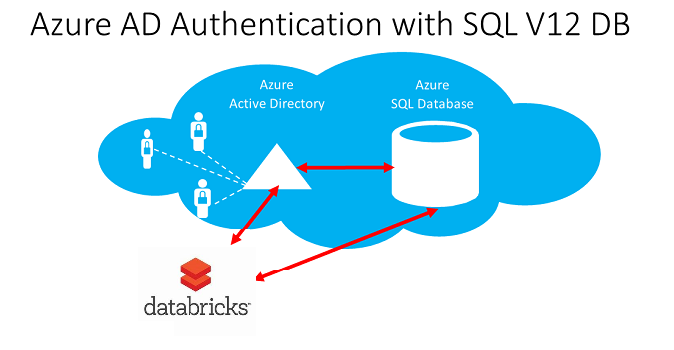
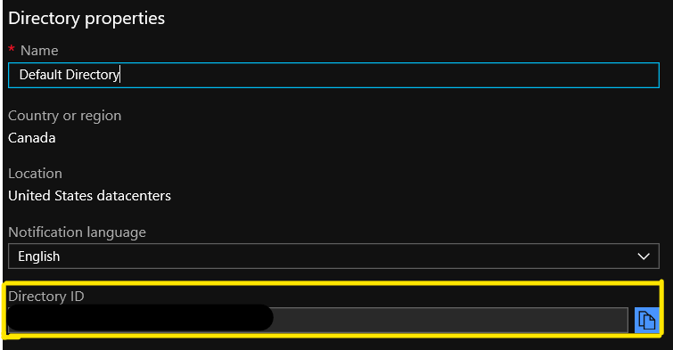
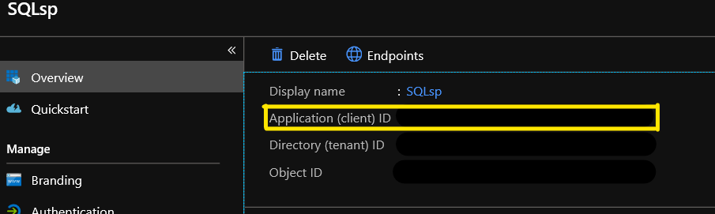

import { Callout } from "../../src/components/atoms.js"
import { ExtLink, InlinePageLink } from "../../src/components/atoms.js"

Azure has recently added the ability to authenticate to Azure SQL Database and Azure SQL Data Warehouse using Azure Active Directory. This allows you to centrally manage identity to your database.



## Azure Active Directory (AAD) authentication

As per Microsoft documentation, [Azure Active Directory](https://docs.microsoft.com/en-us/azure/active-directory/fundamentals/active-directory-whatis) authentication is a mechanism of connecting to Microsoft Azure SQL Data Warehouse and Azure SQL Database by using identities in Azure Active Directory (Azure AD). With Azure Active Directory authentication, you can centrally manage the identities of database users and other Microsoft services in one central location. Central ID management provides a single place to manage SQL Data Warehouse users and simplifies permission management.

See [here](https://docs.microsoft.com/en-us/azure/sql-database/sql-database-aad-authentication) for a great document explaining the details of using Azure Active Directory Authentication for authentication with SQL

## Why Service Principal?

Authenticating with your user name is practical when doing analysis and pulling data from external database sources, but not so much when you want to operationalize your pipeline. This is where an Azure Active Directory application registration (also called service principal) can be used to user accounts from execution accounts.

## Prerequisites

<table class="wp-block-table is-style-stripes">
   <tbody>
      <tr>
         <td>Create an AAD App registration</td>
         <td>You can follow this Microsoft <a href="https://docs.microsoft.com/en-us/azure/active-directory/develop/quickstart-register-app" target="_blank" rel="noreferrer noopener" aria-label=" (opens in a new tab)">doc</a></td>
      </tr>
      <tr>
         <td>Create a secret for your app registration</td>
         <td><a rel="noreferrer noopener" aria-label="This blogs (opens in a new tab)" href="https://blogs.technet.microsoft.com/stefan_stranger/2018/06/06/connect-to-azure-sql-database-by-obtaining-a-token-from-azure-active-directory-aad/" target="_blank">This blogs</a> covers the next 3 steps very well</td>
      </tr>
      <tr>
         <td>Create an AAD Group</td>
         <td>See above</td>
      </tr>
      <tr>
         <td>Add the App registration to the AAD group as a member</td>
         <td>See above</td>
      </tr>
      <tr>
         <td>Add the AAD group to Azure SQL Active Directory Admin</td>
         <td>You can follow <a rel="noreferrer noopener" aria-label="this guide (opens in a new tab)" href="https://docs.microsoft.com/en-us/azure/sql-database/sql-database-aad-authentication-configure#provision-an-azure-active-directory-administrator-for-your-azure-sql-database-server" target="_blank">this guide</a> as well as the above</td>
      </tr>
   </tbody>
</table>

<Callout>
  We're connecting the service principal as a server admin but it could be linked to a user with specific rights in the database using the "CREATE USER FROM EXTERNAL PROVIDER;" statement.
</Callout>

### Gathering some keys

In order to do the next part you will need a few keys:

#### Tenant ID

You can find this in your Azure Active Directory service in the Azure portal in the properties blade and directory id field.  


#### App registration Application (client) ID

You can find this on the overview blade of the app regristration created earlier.  
  

#### Secret key

This was given to you when you initially created the secret. If you did not write it down, you can delete the key and create a new one.

## Connecting to Azure SQL Database

Now that all the plumbing is done we're ready to connect Azure Databricks to Azure SQL Database. In this section we'll be using the keys we gathered to generate an access token which will be used to connect to Azure SQL Database.

Let's look at the building blocks first:

### Adding the required libraries

You will need to add the following libraries to your cluster:

<Callout>

com.microsoft.azure:adal4j:1.6.4 found [here](https://mvnrepository.com/artifact/com.microsoft.azure/adal4j)

com.microsoft.azure:azure-sqldb-spark:1.0.2 found [here](https://mvnrepository.com/artifact/com.microsoft.azure/azure-sqldb-spark)

</Callout>

### Instantiate the ADAL AuthenticationContext object

````scala
//Instantiate the ADAL AuthenticationContext object
 val service = Executors.newFixedThreadPool(1)
 val context = new **AuthenticationContext**(authority, true, service);
````

<table class="wp-block-table is-style-stripes"><tbody><tr><td><strong>Constructor and Description</strong></td></tr><tr><td><strong>AuthenticationContext(String authority, boolean validateAuthority, ExecutorService service)</strong> Constructor to create the context with the address of the authority.</td></tr></tbody></table>

### Get the access token

````scala
//Get access token
 val ClientCred = new ClientCredential(ServicePrincipalId, ServicePrincipalPwd)
 val authResult = context.acquireToken(resourceAppIdURI, ClientCred, null)
 val accessToken = authResult.get().getAccessToken
````

**Constructor and Description**

**ClientCredential(String clientId, String clientSecret)** Constructor to create credential with client id and secret

<table class="wp-block-table alignleft is-style-stripes">
   <tbody>
      <tr>
         <td><strong>acquireToken</strong></td>
      </tr>
      <tr>
         <td><br></br>public&nbsp;<a href="http://docs.oracle.com/javase/7/docs/api/java/util/concurrent/Future.html?is-external=true">Future</a>&lt;<a href="https://static.javadoc.io/com.microsoft.azure/adal4j/1.6.4/com/microsoft/aad/adal4j/AuthenticationResult.html">AuthenticationResult</a>&gt;&nbsp;acquireToken(<br></br><a href="http://docs.oracle.com/javase/7/docs/api/java/lang/String.html?is-external=true">String</a>&nbsp;resource,<br></br><a href="https://static.javadoc.io/com.microsoft.azure/adal4j/1.6.4/com/microsoft/aad/adal4j/AsymmetricKeyCredential.html">AsymmetricKeyCredential</a>&nbsp;credential,<br></br><a href="https://static.javadoc.io/com.microsoft.azure/adal4j/1.6.4/com/microsoft/aad/adal4j/AuthenticationCallback.html">AuthenticationCallback</a>&nbsp;callback)<br></br>throws <a href="https://static.javadoc.io/com.microsoft.azure/adal4j/1.6.4/com/microsoft/aad/adal4j/AuthenticationException.html">AuthenticationException</a><br></br><br></br>Acquires security token from the authority.<br></br><br></br><strong>Parameters:</strong><br></br>resource - Identifier of the target resource that is the recipient of the requested token.<br></br>credential - object representing Private Key to use for token acquisition.<br></br>callback- optional callback object for non-blocking execution.<br></br><br></br><strong>Returns:</strong><br></br>A&nbsp;<a rel="noreferrer noopener" aria-label="Future  (opens in a new tab)" href="http://docs.oracle.com/javase/7/docs/api/java/util/concurrent/Future.html?is-external=true" target="_blank">Future </a>object representing the AuthenticationResult of the call. It contains Access Token and the Access Token's expiration time. Refresh Token property will be null for this overload.<br></br><br></br><strong>Throws:</strong><br></br><a rel="noreferrer noopener" aria-label="AuthenticationException (opens in a new tab)" href="https://static.javadoc.io/com.microsoft.azure/adal4j/1.6.4/com/microsoft/aad/adal4j/AuthenticationException.html" target="_blank">AuthenticationException</a> -&nbsp;<a rel="noreferrer noopener" aria-label="AuthenticationException  (opens in a new tab)" href="https://static.javadoc.io/com.microsoft.azure/adal4j/1.6.4/com/microsoft/aad/adal4j/AuthenticationException.html" target="_blank">AuthenticationException</a><br></br></td>
      </tr>
   </tbody>
</table>

### Putting it together

````scala
import com.microsoft.aad.adal4j.ClientCredential
import com.microsoft.aad.adal4j.AuthenticationContext
import java.util.concurrent.Executors

val TenantId = "**<FILL HERE>**"
val authority = "https://login.windows.net/" + TenantId
val resourceAppIdURI = "https://database.windows.net/"
val ServicePrincipalId = "**<FILL HERE>**"
val ServicePrincipalPwd = "**<FILL HERE>**"

//Instantiate the ADAL AuthenticationContext object
val service = Executors.newFixedThreadPool(1)
val context = new AuthenticationContext(authority, true, service);

//Get access token
val ClientCred = new ClientCredential(ServicePrincipalId, ServicePrincipalPwd)
val authResult = context.acquireToken(resourceAppIdURI, ClientCred, null)
val accessToken = authResult.get().getAccessToken
````

### Querying Azure SQL Database

Once the token generated, you simply need to call the spark.read.sqlDB command and pass the token to authenticate.

````scala
import com.microsoft.azure.sqldb.spark.config.Config
import com.microsoft.azure.sqldb.spark.connect.\_

val config = Config(Map(
   "url"            -> "**<SERVER NAME>**.database.windows.net",
   "databaseName"   -> "**<Database Name>**",
   "dbTable"        -> "**<Table Name>**",
   "accessToken"           -> **accessToken**,
   "hostNameInCertificate" -> "\*.database.windows.net",
   "encrypt"               -> "true"
))

val collection = spark.read.sqlDB(config)

collection.show()
````

As you can see, once the token generated, it's really easy to query Azure SQL Database.

## Hope this helped!
