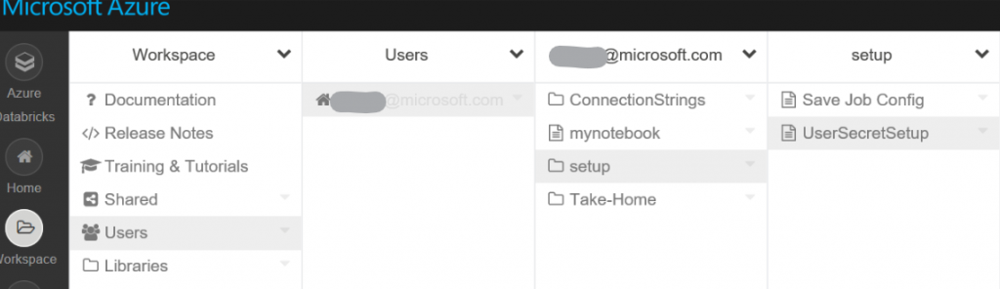

import { Callout } from "../../src/components/atoms.js"
import { ExtLink, InlinePageLink } from "../../src/components/atoms.js"

#### **(Update)** At the time of writing this article, integration with Azure KeyVault didn't exist. Things evolved and suggestions proposed in this post are no longer best practices. See my new blog posts on how to leverage secrets to manage passwords in a more secure way.

https://thedataguy.blog/2018/12/05/managing-passwords-and-secrets-in-azure-databricks-with-keyvault/

Ever had to connect to a Data base or any other systems that require a username and password? Ever wonder how to best manage the sensitive nature of these types of information?

Although hardcoding them in your notebook works when working solo, things can get complicated when working in a collaborative mode or if you wish to share your work with others.

There are many ways this can be tackled but the best way I’ve found is to store the sensitive information on remote storage; Azure Storage Accounts (WASB) or Azure Data Lake.

The below outlines how to handle database connection strings with credentials stored in WASB using JSON.

First would be to create the JSON file containing the connection strings. Here’s an example of a format that can be use:

```json
{  
  "Connections":[  
     {  
        "Name":"DataBricksLab",
        "Type":"jdbc",
        "Properties":{ 
           "ConnectionString":"jdbc:sqlserver://\*\*\*.database.windows.net:1433;database=***;user=\*\*\*;password=\*\*\*;encrypt=true;trustServerCertificate=false;hostNameInCertificate=\*.database.windows.net;loginTimeout=30;"
        }
     },
     {  
        "Name":"ContosoRetailDW",
        "Type":"jdbc",
        "Properties":{  
           "ConnectionString":"jdbc:sqlserver://\*\*\*.database.windows.net:1433;database=\*\*\*;user=\*\*\*;password=\*\*\*;encrypt=true;trustServerCertificate=false;hostNameInCertificate=\*.database.windows.net;loginTimeout=30;"
        }
     }
   ]
}
```

Then, you will need to upload this file to your Azure Blob storage Account.See this link for instructions on how to create a new Azure Storage Account: [Create a storage account](https://docs.microsoft.com/en-us/azure/storage/common/storage-create-storage-account)

Then you will need to upload your file into a container. There are multiple ways of transferring data to your BLOB; [Azure Portal](https://docs.microsoft.com/en-us/azure/storage/files/storage-how-to-use-files-portal), [Powershell](https://www.petri.com/how-to-upload-files-to-microsoft-azure), [CLI](https://docs.microsoft.com/en-us/azure/storage/blobs/storage-quickstart-blobs-cli#upload-a-blob), [Import/Export tool](https://docs.microsoft.com/en-us/azure/storage/common/storage-import-export-tool-how-to?toc=%2fazure%2fstorage%2fblobs%2ftoc.json), Azure Storage Explorer or [AzCopy](https://docs.microsoft.com/en-us/azure/storage/common/storage-use-azcopy?toc=%2fazure%2fstorage%2fblobs%2ftoc.json).

Now comes the fun stuff! In your notebook, I created a setup folder under your user in which I have places some scala code to read, parse and make available your connection strings. This approach will allow you to share any work you've done without giving your shared secret and makes this reusable.

Example of folder structure:



Let's go through the UserSecretSetup notebook which contains all the code used to get and parse the JSON file

First, I've setup some parameters which allow me to specify at runtime the connection details to my BLOB:

```scala
dbutils.widgets.text("inputConfigWASBName","","WASB Storage Account Name")
val inputConfigWASBName = dbutils.widgets.get("inputConfigWASBName")

dbutils.widgets.text("inputConfigWASBContainerName","","WASB Container Name")
val inputConfigWASBContainerName = dbutils.widgets.get("inputConfigWASBContainerName")

dbutils.widgets.text("inputConfigWASBSAS","","WASB SAS token")
val inputConfigWASBSAS = dbutils.widgets.get("inputConfigWASBSAS")

dbutils.widgets.text("inputConfigFile","", "Name of JSON Config File")
val inputConfigFile = dbutils.widgets.get("inputConfigFile").trim
```

Then I setup Spark with the necessary configuration information to my Blob storare:

```scala
spark.conf.set(
  s"fs.azure.sas.$inputConfigWASBContainerName.$inputConfigWASBName.blob.core.windows.net",
  inputConfigWASBSAS)
```

<Callout>
*HINT, notice how I dynamically set the storage account name, container name, etc? In Scala you need to prefix your string with "s" then insert your variable name prefixed with "$": example $inputConfigWASBName
</Callout>

Once that is done I'm ready to read my JSON file from my BLOB storage and store in a data frame:

```scala
val json\_df = spark.read
    .option("multiline", true)
    .json(s"wasbs://$inputConfigWASBContainerName@$inputConfigWASBName.blob.core.windows.net/$inputConfigFile")
```

<Callout>
*HINT, when reading JSON, by default, spark.read.json expects all records to be on a single line. 
</Callout>

Example :  

```json
,{"MLrate":"31","Nrout":"0","up":null,"Crate":"2"} 
,{"MLrate":"30","Nrout":"5","up":null,"Crate":"2"}
```

<Callout>
Adding **.option("multiline", false)** allows formatted JSON documents to be read.
</Callout>

Finally, I extract the connection string information from the dataframe and create a Spark SQL temp view which allows other spark contexts to read; i.e. Python:

```scala
import org.apache.spark.sql.functions.\_

val connections = json\_df.select(explode($"Connections").as("Connection"))
val connection = connections.select("connection.Name", "connection.Type","connection.Properties.ConnectionSting")

connection.createOrReplaceTempView("conn\_df")
```

Now you have all the connection strings loaded in a Spark SQL temp view which can be read from any other notebooks.

Here's an example of executing the setup notebook while passing parameters:

```scala
%run ../setup/UserSecretSetup $inputConfigWASBName="storage account name" $inputConfigWASBContainerName = "container name" $inputConfigWASBSAS = "SAS container token" $inputConfigFile = "configFile.json"
```

Once executed, you can get the connection string you want:

Scala:  

```scala
%scala
val connString = spark.sql("SELECT ConnectionSting FROM conn\_df WHERE Name = 'ConnectionName'").first().getString(0)
```

Python:  

```python
%python
connString = spark.sql("SELECT ConnectionSting FROM conn\_df WHERE Name = 'ConnectionName'").select("ConnectionSting").collect()\[0\]\[0\]
```

Link to my setup notebook which can be imported in your workspace :

Copy URL to clipboard