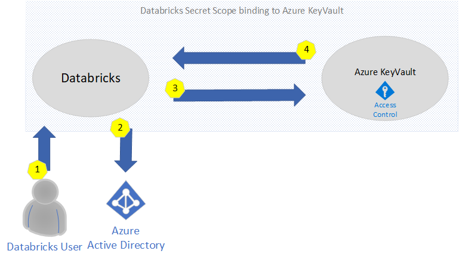
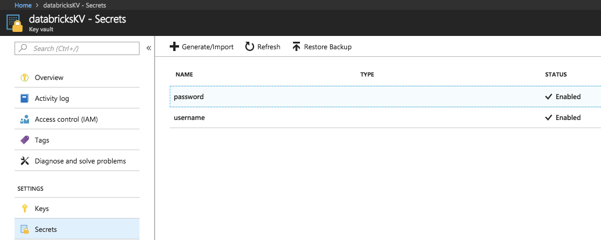

import { Callout } from "../../src/components/atoms.js"
import { ExtLink, InlinePageLink } from "../../src/components/atoms.js"

Continuing on my previous post, changes in the integration between Databricks and Azure have made things even easier... I'm referring to secrets within **Databricks** and Azure **KeyVault**.

First, you will need to create a KeyVault resource within Azure. The following documentation outlines the steps to create this: [https://docs.microsoft.com/en-ca/azure/key-vault/quick-create-portal](https://docs.microsoft.com/en-ca/azure/key-vault/quick-create-portal)

Second, you will need to bind the Azure KeyVault to your Databricks work space. This link explains how to do this: [https://docs.azuredatabricks.net/user-guide/secrets/secret-scopes.html](https://docs.azuredatabricks.net/user-guide/secrets/secret-scopes.html)

<Callout>
   **Note**, access to secrets is managed by their associated Access Control List (ACL). \
</Callout>


### Managing security with your secrets

In order to understand how authentication work, the following diagram explains the flow when a secret is being requested. 



1. A user logs into Databricks Notebook to submits a _get_ command to the secrets API
2. Databricks will be authenticate Azure Active Directory when login in and generate a trusted token
3. Access control is validated via the KeyVault Access Policies
4. If validated, the secret is returned. Otherwise, an error is returned.

<Callout>
  It is very likely that you will have multiple KeyVaults as some are create per security groups or some by project / environment (Dev/Test/Prod). This is done to isolate who has access to certain secrets since **once you have access to a KeyVault and your access policies allow you to list/get secrets, you will have access to all of them.**\
</Callout>


Now that we have a good understanding of how secrets are secured, we can now create them. You can do this via the Azure Portal or via the Databricks CLI.

#### Create a secret in an Azure Key Vault-backed scope

To create a secret in Azure Key Vault you use the Azure [SetSecret](https://docs.microsoft.com/en-us/rest/api/keyvault/setsecret) REST API or Azure portal UI



#### Create a secret in a Databricks-backed scope via CLI

To create a secret in a Databricks-backed scope using the [Databricks CLI](https://docs.azuredatabricks.net/user-guide/dev-tools/databricks-cli.html#databricks-cli)

databricks secrets put --scope --key 

The above will open a text editor that will allow you to specify the secret value.

For a complete list of CLI commands on how to manage secrets, see here: [https://docs.azuredatabricks.net/user-guide/secrets/secrets.html#secrets](https://docs.azuredatabricks.net/user-guide/secrets/secrets.html#secrets)

Finally, you're ready to get the secrets in your notebook via the _get_ command.

Example:

````scala
dbutils.secrets.get(scope = "[REPLACE WITH YOUR SCOPE NAME]", key = "[REPLACE WITH YOUR SECRET NAME]")
````
_Thanks you!_
