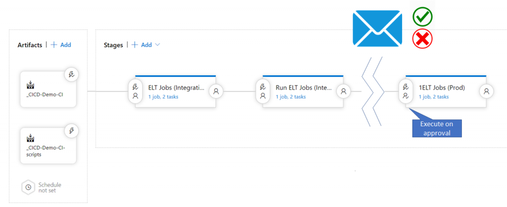
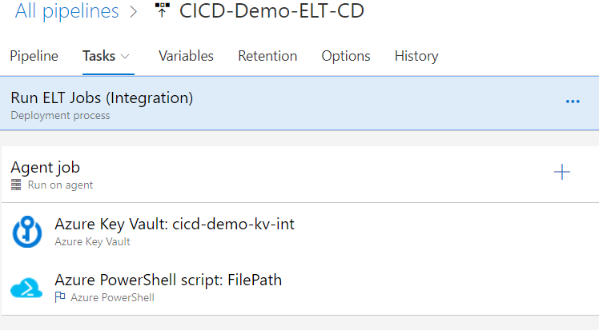
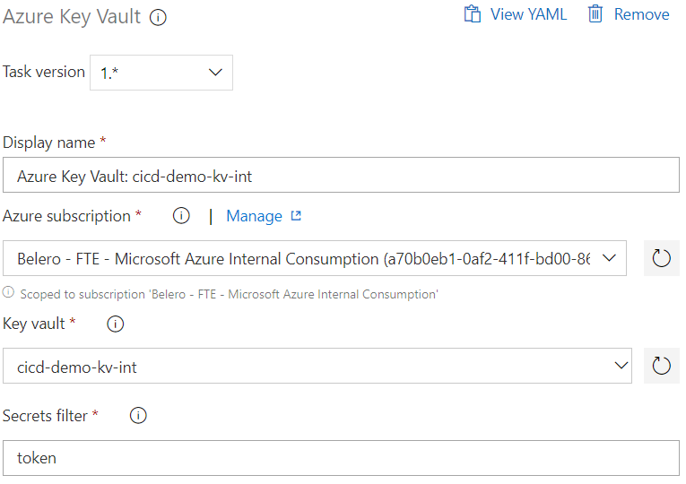
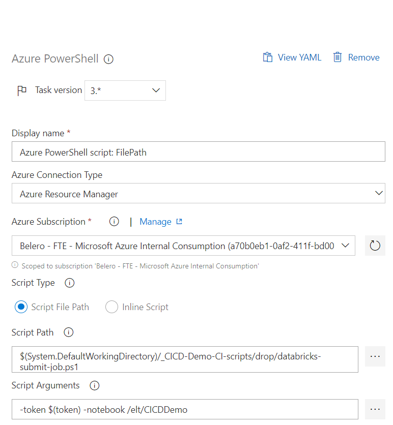
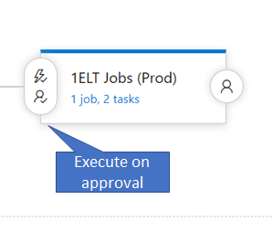
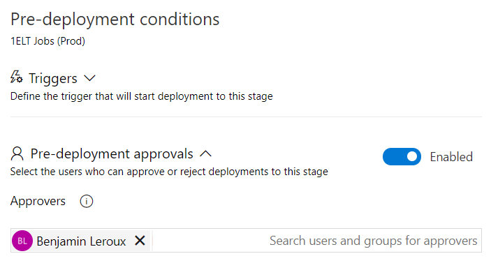

import { Callout } from "../../src/components/atoms.js"
import { ExtLink, InlinePageLink } from "../../src/components/atoms.js"



What happens if you have multiple environment? Or, what happens if you need to make sure your notebook passes unit testing before making its way to production?

In my previous post we saw how you can use Azure DevOps to automatically push changes from one environment to another. This worked well if you have only 2 environments with no requirements to validate before deployment.

In this post I will cover how you can execute a Databricks notebook, push changes to production upon successful execution and approval by a stage pre-deployment approval process.

## Executing an Azure Databricks Notebook

Azure Databricks has a very comprehensive REST API which offers 2 ways to execute a notebook; via a **job** or a **one-time run**. See [here](https://docs.azuredatabricks.net/api/latest/index.html) for the complete "jobs" api.

As we're trying to execute a notebook for testing, a one-time run seems to be be a better fit no? Another challenge is the execution of the REST API call will be asynchronous and will required continuous polling of the status to see if it was a success or failure. Let's take a closer look.

### [Run-Submit](https://docs.azuredatabricks.net/api/latest/jobs.html#runs-submit) REST API Call

<table><tbody><tr><td><strong>Endpoint</strong></td><td><strong>HTTP Method</strong></td></tr><tr><td>2.0/jobs/runs/submit</td><td>POST</td></tr></tbody></table>

<Callout>
The API URL is structured as:

https://.azuredatabricks.net/api/2.0/jobs/runs/submit

Example API Call URL:

https://eastus2.azuredatabricks.net/api/2.0/jobs/runs/submit\
</Callout>


From Databricks documentation, a run-submit call submits a one-time run. This endpoint doesn’t require a Databricks job to be created. You can directly submit your workload. Runs submitted via this endpoint don’t display in the UI. Once the run is submitted, use the jobs/runs/get API to check the run state.

<Callout>
We suggest running jobs on new clusters for greater reliability.
</Callout>


### [Runs-Get](https://docs.azuredatabricks.net/api/latest/jobs.html#runs-get) Rest API Call

<table><tbody><tr><td><strong>Endpoint</strong></td><td><strong>HTTP Method</strong></td></tr><tr><td>2.0/jobs/runs/get</td><td>GET</td></tr></tbody></table>

From Databricks documentation, a runs-get call retrieves the metadata of a run.

<Callout>
You use this API call to get the status of a running job. This is the mechanism we'll use to poll our submit call
</Callout>


### The magic sauce

You can use bash, PowerShell or any type of scripting language to call the 2 API above but I've found using PowerShell was the simplest. Let's take a look at a snippet of a larger script.

````PowerShell
$urlRunsSubmit = "https://eastus2.azuredatabricks.net/api/2.0/jobs/runs/submit"
$urlRunsGet = "https://eastus2.azuredatabricks.net/api/2.0/jobs/runs/get"
$ContentType = "application/json"

$json = @"
{
  "run\_name": "my spark task",
  "new\_cluster": {
    "spark\_version": "5.3.x-scala2.11",
    "node\_type\_id": "Standard\_D16s\_v3",
    "num\_workers": 2
  }, 
  "timeout\_seconds": 3600,
  "notebook\_task": {
    "notebook\_path": "**$($notebook)**"
  }
}
"@

$post = Invoke-RestMethod -Method Post -Uri $urlRunsSubmit -Body $json -ContentType $ContentType -Headers @{"Authorization"="Bearer **$token**"}
  
$urlRunsGet = $urlRunsGet + "?run\_id=" + $post.run\_id

DO {

  $post = Invoke-RestMethod -Method Get -Uri $urlRunsGet -ContentType $ContentType -Headers @{"Authorization"="Bearer **$token**"}
  
} While ( ($post.state.life\_cycle\_state -ne "TERMINATED") -and ($post.state.life\_cycle\_state -ne "INTERNAL\_ERROR"))
````

### Let's break things up a bit

#### Configuring the endpoints

````PowerShell
$urlRunsSubmit = "https://**eastus2**.azuredatabricks.net/api/2.0/jobs/runs/submit"
$urlRunsGet = "https://**eastus2**.azuredatabricks.net/api/2.0/jobs/runs/get"
````
As I mentioned above, submitting a new job to run will be done in asynchronous matter. This means you will simply get a run id in return with no idea if the job ran successfully or not, hence the need to call 2 APIs; submit and get. Each API requires an endpoint to which is what I set here.

<Callout>
Note that eastus2 is used for the region. Make sure to replace with the region your Databricks workspace is deplpyed in.
</Callout>

#### Preparing the runs-submit POST body
````PowerShell
$json = @"
{
  "run\_name": "my spark task",
  "new\_cluster": {
    "spark\_version": "5.3.x-scala2.11",
    "node\_type\_id": "Standard\_D16s\_v3",
    "num\_workers": 2
  }, 
  "timeout\_seconds": 3600,
  "notebook\_task": {
    "notebook\_path": "**$($notebook)**"
  }
}
"@ 
````

The submit API call uses the POST method which means you will need to provide a body to your API call. The body needs to be a JSON following the format specified in the API documentation. See above for documentation link.

The above JSON will create a new run called "my spark task" and will run a cluster created on demand. This cluster will be using the "5.3.x-scala2.11" runtime and run "Standard\_D16s\_v3" for the worker master nodes with 2 workers.

The notebook to be executed is being fed by a parameter to this PowerShell script represented by "**$($notebook)**", but could be hardcoded also. Example, "/shared/mynotebook"

#### Submit the notebook run

````PowerShell
$post = Invoke-RestMethod -Method Post -Uri $urlRunsSubmit -Body $json -ContentType $ContentType -Headers @{"Authorization"="Bearer **$token**"}
````

In PowerShell you can invoke a REST API call by using the Invoke-RestMethod. I wont go into details of each parameters I'm passing except for 2:

<table class="has-fixed-layout"><tbody><tr><td>Method</td><td>I specify POST as this API call us defined as a POST type method</td></tr><tr><td>Header</td><td>Along with the URL which specifies which region your workspace is in, the Header is required to authenicate. To do this, we beed to pass a bearer token, where the token genereted in Databricks as per <a href="https://docs.azuredatabricks.net/api/latest/authentication.html#generate-a-token" target="_blank" rel="noreferrer noopener" aria-label="these instructions (opens in a new tab)">these instructions</a></td></tr></tbody></table>

#### Setting up status polling

````PowerShell
$urlRunsGet = $urlRunsGet + "?run\_id=" + $post.run\_id 

DO {
  $post = Invoke-RestMethod -Method Get -Uri $urlRunsGet -ContentType $ContentType -Headers @{"Authorization"="Bearer **$token**"}
} While ( ($post.state.life\_cycle\_state -ne "TERMINATED") -and ($post.state.life\_cycle\_state -ne "INTERNAL\_ERROR"))
````

After submitting the run you can capture the run id which will be required to get the run status. The run id needs to be appended to the polling get method API call and then can be called in a while loop. This will run until it either fails or succeeds; this can be determined by the state.life\_cycle\_state property.

You can get my PowerShell Script from [my GitHub repository](https://github.com/benleroux/DatabricksDevOpsRun/blob/master/databricks-submit-job.ps1). 
<Callout>  
  Note, it's a work in progress as it doesn't report back the proper error to DevOps on failure. But hey, it's a start!
</Callout>

## Executing in DevOps

Now that we've create a PowerShell script that can call and validate a notebook, the next step is to execute this in DevOps. To do this, we'll need a Databricks token for authentication as well as an Azure PowerShell script: FilePath task.

### Getting the token

The token is generated in Azure Databricks via [this method](https://docs.databricks.com/api/latest/authentication.html#generate-a-token) and can either be hard coded in the PowerShell execution task or you can store the token in Azure Key Vault and use the DevOps Azure KeyVault task to pull the token; that method is safer. See [here](https://docs.microsoft.com/en-us/azure/devops/pipelines/tasks/deploy/azure-key-vault?view=azure-devops) to see how to add secrets in KeyVault.

### Adding a new stage

Once the token is generated, in a existing stage or a new stage in DevOps, add 2 tasks: the Azure KeyVault task and and Azure PowerShell script task.



Stage should look like this

### Configuring the KeyVault task

In order to configure the KeyVault task, you will need to select your Azure subscription and your KeyVault. Once done you will need to specify the name of the secret containing your token.



KeyVault task should look like this

<Callout>
Note, when authenticating DevOps to the KeyVault, a service principal is created and added to the KeyVault IAM RBAC. This same user needs to be added to the the KeyVault security policy and given at least LIST and GET rights for secret. If not done, you will get an error while running this task.
</Callout>


### Configuring the Azure PowerShell task

Executing a PowerShell script in DevOps is pretty easy when using PowerShell. DevOps has a cool task that allows you to run a script within the Azure echo system. Let's take a look how to configure this.

In order to configure this task, you will need to specify the following:

<table class="has-fixed-layout"><tbody><tr><td>Azure Connection Type</td><td>Set this to Azure Resource Manager (ARM)</td></tr><tr><td>Azure Subscription</td><td>Pick your Azure subscription where Databricks is running</td></tr><tr><td>Script Type</td><td>This can either inline where you simply paste your PowerShell code or via Script path where you must use your Git repo to store the script and reference it here.</td></tr><tr><td>Path or code</td><td>Depending on the choice above, you will wither paste the script inline or browse your Git Repo for the PowerShell script</td></tr><tr><td>Script Arguments</td><td>if you've included any parameters in your script, you will need to set them here. My script uses 2 parameters; token and notebook path</td></tr></tbody></table>



You're done. You can run your release if all works well, your notebook will be executed :)

## But wait, there's more!!!

Did you know in DevOps you can you setup email approval between stages? Think about this scenario, you run a notebook as part of integration testing and should it execute successfully, you kick off the deploy to Prod. In this scenario, you might want to have a manual checkpoint asking someone to approve the move to prod. This is called a pre-deployment condition.

### Adding the pre-deployment condition



To do this, you will need have another stage after the testing stage we used above and click on the person icon / lightning bold icon to the left of the stage.

### Configuring the pre-deployment condition

You only need to enable the pre-deployment condition and specify the approver email addresses.



I'm done. Hope this helps!
